* Table of Contents
{:toc}

--------------------------------------------------------------------------------------------------------------------

## **Acknowledgements**

* Libraries used: [JavaFX](https://openjfx.io/), [Jackson](https://github.com/FasterXML/jackson), [JUnit5](https://github.com/junit-team/junit5), [OpenCSV](https://opencsv.sourceforge.net/)

* Adapted from: [AddressBook Level 3](https://github.com/nus-cs2103-AY2223S1/tp)

--------------------------------------------------------------------------------------------------------------------

## **Setting up, getting started**

Refer to the guide [_Setting up and getting started_](SettingUp.md).

--------------------------------------------------------------------------------------------------------------------

## **Design**

:bulb: **Tip:** The `.puml` files used to create diagrams in this document can be found in the [diagrams](https://github.com/se-edu/addressbook-level3/tree/master/docs/diagrams/) folder. Refer to the [_PlantUML Tutorial_ at se-edu/guides](https://se-education.org/guides/tutorials/plantUml.html) to learn how to create and edit diagrams.

### Architecture

The ***Architecture Diagram*** given above explains the high-level design of the App.

Given below is a quick overview of main components and how they interact with each other.

**Main components of the architecture**

**`Main`** has two classes called [`Main`](https://github.com/se-edu/addressbook-level3/tree/master/src/main/java/seedu/address/Main.java) and [`MainApp`](https://github.com/se-edu/addressbook-level3/tree/master/src/main/java/seedu/address/MainApp.java). It is responsible for,
* At app launch: Initializes the components in the correct sequence, and connects them up with each other.
* At shut down: Shuts down the components and invokes cleanup methods where necessary.

[**`Commons`**](#common-classes) represents a collection of classes used by multiple other components.

The rest of the App consists of four components.

* [**`UI`**](#ui-component): The UI of the App.
* [**`Logic`**](#logic-component): The command executor.
* [**`Model`**](#model-component): Holds the data of the App in memory.
* [**`Storage`**](#storage-component): Reads data from, and writes data to, the hard disk.

**How the architecture components interact with each other**

The *Sequence Diagram* below shows how the components interact with each other for the scenario where the user issues the command `deletePerson 1`.

Each of the four main components (also shown in the diagram above),

* defines its *API* in an `interface` with the same name as the Component.
* implements its functionality using a concrete `{Component Name}Manager` class (which follows the corresponding API `interface` mentioned in the previous point.

For example, the `Logic` component defines its API in the `Logic.java` interface and implements its functionality using the `LogicManager.java` class which follows the `Logic` interface. Other components interact with a given component through its interface rather than the concrete class (reason: to prevent outside component's being coupled to the implementation of a component), as illustrated in the (partial) class diagram below.

The sections below give more details of each component.

### UI component

The **API** of this component is specified in [`Ui.java`](https://github.com/se-edu/addressbook-level3/tree/master/src/main/java/seedu/address/ui/Ui.java)

The UI consists of a `MainWindow` that is made up of parts e.g.`CommandBox`, `ResultDisplay`, `PersonListPanel`, `EventListPanel`, `StatusBarFooter` etc. All these, including the `MainWindow`, inherit from the abstract `UiPart` class which captures the commonalities between classes that represent parts of the visible GUI.

The `UI` component uses the JavaFx UI framework. The layout of these UI parts are defined in matching `.fxml` files that are in the `src/main/resources/view` folder. For example, the layout of the [`MainWindow`](https://github.com/se-edu/addressbook-level3/tree/master/src/main/java/seedu/address/ui/MainWindow.java) is specified in [`MainWindow.fxml`](https://github.com/se-edu/addressbook-level3/tree/master/src/main/resources/view/MainWindow.fxml)

The `UI` component,

* executes user commands using the `Logic` component.
* listens for changes to `Model` data so that the UI can be updated with the modified data.
* keeps a reference to the `Logic` component, because the `UI` relies on the `Logic` to execute commands.
* depends on some classes in the `Model` component, as it displays `Person` objects and `Event` objects residing in the `Model`,
and can display statistics of `Persons` objects tagged to `Event` objects as well.

### Logic component

**API** : [`Logic.java`](https://github.com/se-edu/addressbook-level3/tree/master/src/main/java/seedu/address/logic/Logic.java)

Here's a (partial) class diagram of the `Logic` component:

How the `Logic` component works:
1. When `Logic` is called upon to execute a command, it uses the `AddressBookParser` class to parse the user command.
1. This results in a `Command` object (more precisely, an object of one of its subclasses e.g., `AddPersonCommand`) which is executed by the `LogicManager`.
1. The command can communicate with the `Model` when it is executed (e.g. to add a person).
1. The result of the command execution is encapsulated as a `CommandResult` object which is returned back from `Logic`.

The Sequence Diagram below illustrates the interactions within the `Logic` component for the `execute("deletePerson 1")` API call.

:information_source: **Note:** The lifeline for `DeletePersonCommandParser` should end at the destroy marker (X) but due to a limitation of PlantUML, the lifeline reaches the end of diagram. This error will appear later as well so take note of this PlantUML limitation.

 
Here are the other classes in `Logic` (omitted from the class diagram above) that are used for parsing a user command:

How the parsing works:
* When called upon to parse a user command, the `AddressBookParser` class creates an `XYZCommandParser` (`XYZ` is a placeholder for the specific command name e.g., `AddPersonCommandParser`) which uses the other classes shown above to parse the user command and create a `XYZCommand` object (e.g., `AddPersonCommand`) which the `AddressBookParser` returns back as a `Command` object.
* All `XYZCommandParser` classes (e.g., `AddPersonCommandParser`, `DeletePersonCommandParser`, ...) inherit from the `Parser` interface so that they can be treated similarly where possible e.g, during testing.

### Model component
**API** : [`Model.java`](https://github.com/se-edu/addressbook-level3/tree/master/src/main/java/seedu/address/model/Model.java)

The `Model` component,

* stores the address book data i.e., all `Person` and `Events` objects (which are contained in the `UniquePersonList` and `UniqueEventList` objects).
* stores the currently 'selected' `Person` objects (e.g., results of a search query) as a separate _filtered_ list which is exposed to outsiders as an unmodifiable `ObservableList<Person>` that can be 'observed' e.g. the UI can be bound to this list so that the UI automatically updates when the data in the list change.
* stores the currently 'selected' `Event` objects (e.g., results of a search query) as a separate _filtered_ list which is exposed to outsiders as an unmodifiable `ObservableList<Event>` that can be 'observed' e.g. the UI can be bound to this list so that the UI automatically updates when the data in the list change.
* stores a `UserPref` object that represents the user’s preferences. This is exposed to the outside as a `ReadOnlyUserPref` objects.
* does not depend on any of the other three components (as the `Model` represents data entities of the domain, they should make sense on their own without depending on other components)

### Storage component

**API** : [`Storage.java`](https://github.com/se-edu/addressbook-level3/tree/master/src/main/java/seedu/address/storage/Storage.java)

The `Storage` component,
* can save both address book data and user preference data in json format, and read them back into corresponding objects.
* inherits from both `AddressBookStorage` and `UserPrefStorage`, which means it can be treated as either one (if only the functionality of only one is needed).
* depends on some classes in the `Model` component (because the `Storage` component's job is to save/retrieve objects that belong to the `Model`)

### Common classes

Classes used by multiple components are in the `seedu.addressbook.commons` package.

--------------------------------------------------------------------------------------------------------------------

## **Implementation**

This section describes some noteworthy details on how certain features are implemented.

### Sort Persons

The sort persons feature allows the user to sort persons by their name, date of birth or gender.

The field to sort persons by is encapsulated within the `PersonSortField` class. `PersonSortField` stores the sort field enumeration (`PersonSortFieldType`) as well as the `Comparator` object that defines the sorting logic.

The following class diagram shows how the `PersonSortField` class integrates with the other components:

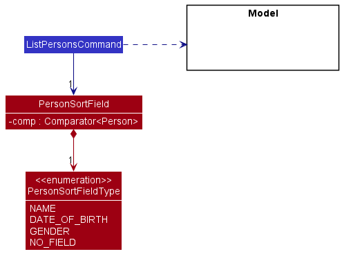
  

Sorting is performed as part of `listPersonsCommand#execute()`. The sorting operation is exposed in the `Model` interface as `Model#sortPersons()` which calls `AddressBook#sortPersons()` which in turn calls `UniquePersonList#sort()` to sort the underlying `ObservableList<Person>`.

The following sequence diagram illustrates the relevant sorting method calls for the command `listPersons s/n` with a `PersonSortField` object `s`:

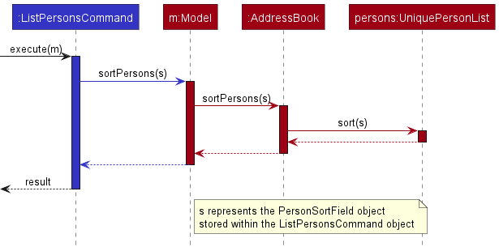

:information_source: **Note:** Sorting is performed directly on the underlying `UniquePersonList` object, which means the sorted result is **permanent**. For example, if `listPersons s/n` and `listPersons` are executed back-to-back, the result of the second `listPersons` command will display the sorted results from the first `listPersons s/n` command because the sorted result is permanent.

#### Design Considerations:

**Aspect: How sorting is performed:**

Ideally, sorting should be a "view" level operation that doesn't change the underlying person list. However, the way the UI is designed makes it difficult to implement sorting as such. The issue is that the UI is **hardcoded** to only display persons from the `UniquePersonList` object. As such, any changes to the person list must be made directly to the `UniquePersonList` object. i.e. A modified copy of the person list cannot be passed to the UI during runtime since the UI is hardcoded to show only the `UniquePersonList` object.

Therefore, given the constraints of the UI, sorting is implemented as a **permanent operation**.

* **Alternative 1 (current choice):** Sort the underlying person list directly.
  * Pros: User can directly use the index numbers of the sorted list to interact with the persons using other commands such as `editPerson` or `deletePerson`.
  * Cons: Sorted result is permanent, instead of being a "view" level operation.

* **Alternative 2:** Sort the person list at the UI level.
   * Pros: Sorted result is not permanent. So sorting won't interfere with the underlying person list.
   * Cons: Requires redesigning a significant part of the `UI`, `Logic` and `Model` classes.

### Adding Events

The Add Event feature that is accessed through the `addEvent` command allows users to add new marketing campaigns of
the `event` class to the application.

The `event` added by the user will have 4 compulsory fields:
- Title of the `event`
- Date of the `event`
- Time of the `event`
- Purpose of the `event`

The `addEvent` operation is facilitated by `AddEventCommand` which extends from `Command`. If the users' input matches
the `COMMAND_WORD` of `AddEventCommand` in `AddressBookParser#parseCommand()`, `AddEventCommandParser#parse()` will
process the additional user inputs which constitute the 4 compulsory fields of the `event` class and return an
`AddEventCommand`.

Executing this Command object through the `AddEventCommand#execute()` triggers the `Model` interface's
`Model#addEvent()`. This operation subsequently calls upon the `AddressBook#addEvent()` operation which in turn calls
upon the `UniqueEventList#add()` operation and the `event` will be stored in memory.

The addEvent operation will also trigger the `StorageManager#saveAddressBook()` operation which will save the event to
a .JSON format together with all other `Person`(s) and `Event`(s) in memory.

The following sequence diagram will illustrate how the `addEvent` operation works:

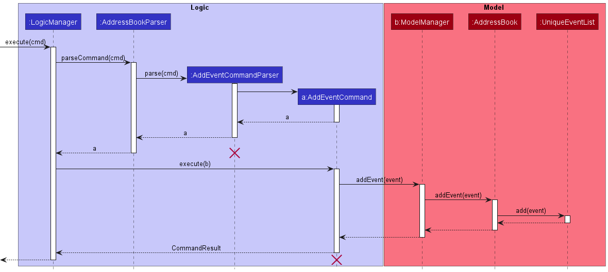

:information_source: **Note:** `cmd` in the diagram represents the add
event command text entered by user. event represents the event class created and stored within AddEventCommand.
Additionally, saving of the updated events list has been excluded from this diagram for simplicity.

### Editing Events

The Edit Event feature that is accessed through the `editEvent` command allows users to edit existing marketing campaigns of
the `Event` class in the application.

The `event`edited by the user allows the user to edit one or more of the 4 existing fields:
- Title of the `event`
- Date of the `event`
- Time of the `event`
- Purpose of the `event`

The `editEvent` operation is facilitated by `EditEventCommand` which extends from `Command`. If the users' input matches
the `COMMAND_WORD` of `EditEventCommand` in `AddressBookParser#parseCommand()`, `EditEventCommandParser#parse()` will
process the additional user inputs which include one or more of the 4 fields and return a `EditEventCommand`.

Executing this Command object through the `EditEventCommand#execute()` triggers the `Model` interface's
`Model#setEvent()`. This operation subsequently calls upon the `AddressBook#setEvent()` operation which in turn calls
upon the `UniqueEventList#setEvent()` operation and the existing `event` will be replaced with the new edited `event` in memory.

The editEvent operation will also trigger the `StorageManager#saveAddressBook()` operation which will save the current list of events, which will save the edited event together with all other `Person`(s) and `Event`(s) to a .JSON format in memory.

The following sequence diagram will illustrate how the `editEvent` operation works:

:information_source: **Note:** `cmd` in the diagram represents the edit
event command text entered by user; the `setEvent(E1, E2)` method replaces event E1 with event E2 in the event list
in the model. Additionally, saving of the updated events list has been excluded from this diagram for simplicity.

### Deleting Events

The Delete Event feature that is accessed through the `deleteEvent` command allows users to delete marketing campaigns of
the `event` class in the application.

The `deleteEvent` operation is facilitated by `DeleteEventCommand` which extends from `Command`. If the users' input matches
the `COMMAND_WORD` of `DeleteEventCommand` in `AddressBookParser#parseCommand()`, `DeleteEventCommandParser#parse()` will
process the additional user input which is the current index of the marketing event on the User Interface and return a `DeleteEventCommand`.

Executing this Command object through the `DeleteEventCommand#execute()` triggers the `Model` interface's
`Model#deleteEvent()`. This operation subsequently calls upon the `AddressBook#deleteEvent()` operation which in turn calls
upon the `UniqueEventList#remove()` operation and the `event` will be removed from memory.

The deleteEvent operation will also trigger the `StorageManager#saveAddressBook()` operation which will save the current
list of events which excludes the deleted event to a .JSON format together with all other `Person`(s) in memory.

The following sequence diagram will illustrate how the `deleteEvent` operation works:

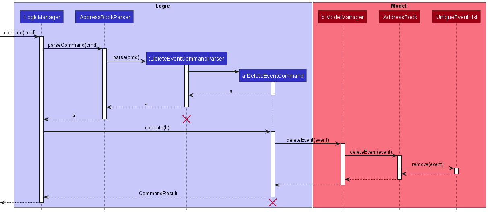

:information_source: **Note:** `cmd` in the diagram represents the delete
event command text entered by user. event represents the instance of event class created and stored within DeleteEventCommand.
Additionally, saving of the updated events list from has been excluded from this diagram for simplicity.

### Listing Events

The List Events feature allows users to enter `listEvents` and update the UI display for events, showing a list of all
events sorted in their current order inside `ModelManager`. In the future, the command will take in a parameter,
which specifies the field that the events list can be permanently sorted by.

The List Events feature is facilitated by `ListEventsCommand` which extends from `Command`. Additionally, it implements
the following operation:

* `ModelManager#updateFilteredEventList()`  — Updates the predicate inside `ModelManager`'s filtered event list
to modify and sort which and how events are shown.

This operation is exposed in the `Model` interface as the method `Model#updateFilteredEventList()`.

The following sequence diagram shows how the `listEvents` operation works.

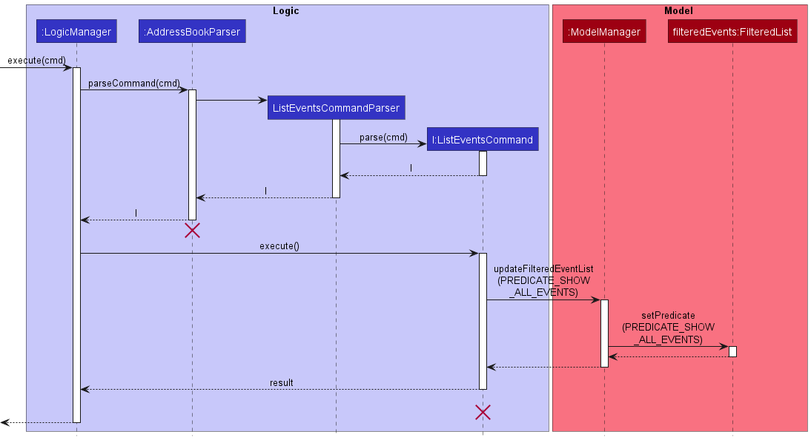

:information_source: **Note:** Only the activities related to events are
considered and shown in this activity diagram.

:information_source: **Note:** The lifeline for `ListEventsCommand` should
end at the destroy marker (X) but due to a limitation of PlantUML, the lifeline reaches the end of the diagram.

#### Design Considerations:

**Aspect: If `listEvents` should sort events permanently:**
* **Alternative 1 (current choice):** Sort all events permanently.
  * Pros: Easy to implement.
  * Cons: Whenever events are added, they are always added as the last event in the event list. Once sorted, the order
  cannot be returned to the order which events were added.
* **Alternative 2:** Sort all events temporarily.
  * Pros: When users sort their events, the ordering of the events in `ModelManager` stays constant.
  * Cons: Hard to implement as a new form of storage or memory has to be created to maintain the relative ordering of
    events.

### Tagging Event

The Tag Event feature that is accessed through the `tagEvent` command allows users to tag persons in the persons list to existing marketing campaigns of the `event` class in the application.

In order to tag persons from a `event`, users need to specify:
- Index of the `event`
- Index(s) of the `person`s to tag from the `event`

:information_source: **Note:** Tagging of persons in an event is basically the same as editing an event, except we are now editing the `UidList` that is in the event, which is the list of the Uids of persons tagged to the event.

The `tagEvent` operation is facilitated by `TagEventCommand`, which extends from `Command`. If the users' input matches the `COMMAND_WORD` of `TagEventCommand` in `AddressBookParser#parseCommand()`, `TagEventCommandParser#parse()` will process the additional user inputs which constitute 2 compulsory fields above and return a `TagEventCommand`.

Executing this Command object through the `TagEventCommand#execute()` triggers the `Model` interface's
`Model#setEvent()`. This operation subsequently calls upon the `AddressBook#setEvent()` operation which in turn calls
upon the `UniqueEventList#setEvent()` operation and the existing `event` will be replaced with the new edited `event` with the new tagged `person`s in memory.

The tagEvent operation will also trigger the `StorageManager#saveAddressBook()` operation which will save the edited event to a .JSON format together with all other `Person`(s) and `Event`(s) in memory.

The following sequence diagram will illustrate how the `tagEvent` operation works:

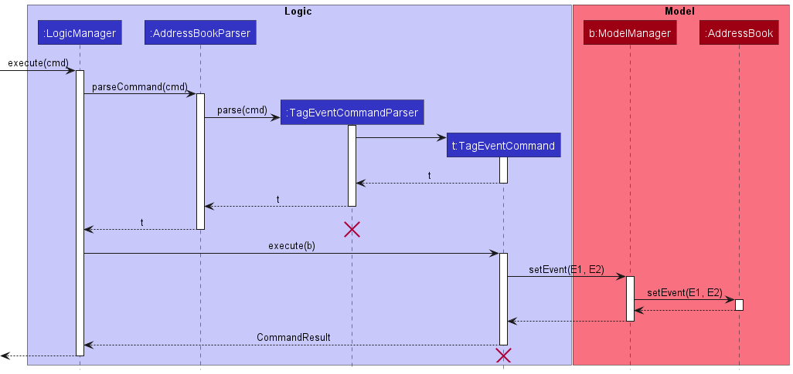

:information_source: **Note:** `cmd` in the diagram represents the tag
event command text entered by user; the `setEvent(E1, E2)` method replaces event E1 with event E2 in the event list
in the model. Additionally, saving of the updated events list has been excluded from this diagram for simplicity.

### Untagging Event

The Untag Event feature that is accessed through the `untagEvent` command allows users to untag persons from existing marketing campaigns of the `event` class in the application.

In order to untag persons from a `event`, users need to specify:
- Index of the `event`
- Index(s) of the `person`s to untag from the `event`

:information_source: **Note:** Untagging of persons from an event is basically the same as editing an event, except we are now editing the `UidList` in the event, which is the list of the Uids of persons tagged to the event.

The `untagEvent` operation is facilitated by `UntagEventCommand`, which extends from `Command`. If the users' input matches the `COMMAND_WORD` of `UntagEventCommand` in `AddressBookParser#parseCommand()`, `UntagEventCommandParser#parse()` will process the additional user inputs which constitute 2 compulsory fields above and return a `UntagEventCommand`.

Executing this Command object through the `UntagEventCommand#execute()` triggers the `Model` interface's
`Model#setEvent()`. This operation subsequently calls upon the `AddressBook#setEvent()` operation which in turn calls
upon the `UniqueEventList#setEvent()` operation and the existing `event` will be replaced with the new edited `event` with the new untagged `person`s in memory.

The untagEvent operation will also trigger the `StorageManager#saveAddressBook()` operation which will save the current list of events, which will save the edited event to a .JSON format together with all other `Person`(s) and `Event`(s) in memory.

The following sequence diagram will illustrate how the `untagEvent` operation works:

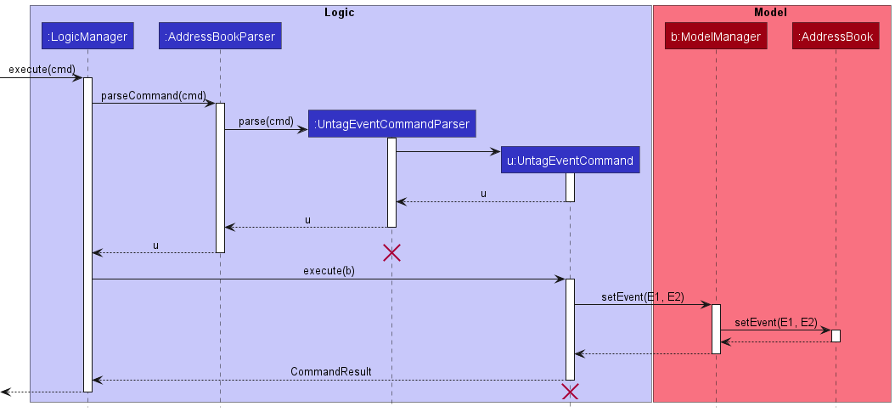

:information_source: **Note:** `cmd` in the diagram represents the untag
event command text entered by user; the `setEvent(E1, E2)` method replaces event E1 with event E2 in the event list
in the model. Additionally, saving of the updated events list has been excluded from this diagram for simplicity.

### Add Person

The Add Person feature that is accessed through the `addPerson` command allows users to add persons of the `Person` class to the person list in the application.

 The `person` added by the user will have 6 compulsory user-specified fields:
- Name of the `person`
- Phone number of the `person`
- Email of the `person`
- Address of the `person`
- Gender of the `person`
- Date of birth of the `person`

:information_source: **Note:** There is also a Uid field that is a unique identification
value of type String that is automatically generated for every new person when they are instantiated.

The `addPerson` operation is facilitated by `AddPersonCommand` which extends from `Command`. If the users' input matches
the `COMMAND_WORD` of `AddPersonCommand` in `AddressBookParser#parseCommand()`, `AddPersonCommandParser#parse()` will
process the additional user input which constitutes the 6 compulsory fields and return an `AddPersonCommand`.

Executing this Command object through the `AddPersonCommand#execute()` triggers the `Model` interface's
`Model#addPerson()`. This operation subsequently calls upon the `AddressBook#addPerson()` operation which in turn calls
upon the `UniquePersonList#add()` operation and the `person` will be stored in memory.

The addPerson operation will also trigger the `StorageManager#saveAddressBook()` operation which will save the new person to a .JSON format together with all other `Event`(s) and `Person`(s) in memory.

The following sequence diagram shows the methods calls related to the add person operation:

:information_source: **Note:** `cmd` in the diagram represents the add
person command text entered by user. The specific `UniquePersonList` operations are not shown in the diagram
for simplicity. Additionally, saving of the updated persons list from has also been excluded from this diagram for simplicity.

#### Add Gender field (Closer look)
Let's take a closer look at how the `AddPersonCommand` adds the `Gender` field.

The following activity diagram shows what happens when a user executes a new add person command:

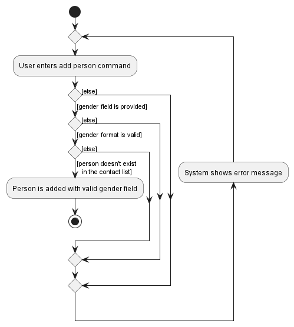

:information_source: **Note:** Only the
activities related to gender field are considered and shown in this activity diagram.

:information_source: **Note:**Parser exceptions are thrown and caught if
gender field is not provided in the command, or the gender is not of valid format; Duplicated person exception is
thrown if the person to add already exists in the person list. Error message is displayed on the GUI subsequently.

:information_source: **Note:**Due to limitations of PlantUML, there are a few extra branch nodes that are created. Do ignore these.

#### Design considerations:

**Aspect: Whether gender field should be optional for a person:**

* **Alternative 1 (current choice):** Compulsory gender field:
    * Pros: It is a more logical implementation as gender is a common attribute for all persons,
  similar to name, address, etc, which are also compulsory fields for persons.
    * Cons: It is less flexible, as the gender cannot be left blank.

* **Alternative 2:** Optional gender field:
    * Pros: It is a more flexible implementation, since the user has the choice to set gender to male, female or leave it blank.
    * Cons: It is less logical since gender is usually a required and given field when discussing the properties of a person.

#### Add Date of Birth field (Closer look)
Let's take a closer look at how the `AddPersonCommand` adds the `date of birth` field.

The following activity diagram shows what happens when a user executes a new add person command:

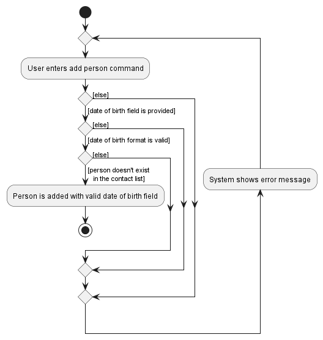

:information_source: **Note:** Only the
activities related to date of birth field are considered and shown in this activity diagram.

:information_source: **Note:**Parser exceptions are thrown and caught if
date of birth field is not provided in the command, or the date of birth is not of valid format; Duplicate person exception is
thrown if the person to add already exists in the addressbook. Error message is displayed on the GUI subsequently.

:information_source: **Note:**Due to limitations of PlantUML, there are a few extra branch nodes that are created. Do ignore these.

#### Design considerations:

**Aspect: Whether date of birth field should be optional for a person:**

* **Alternative 1 (current choice):** Compulsory date of birth field:
    * Pros: It is a more logical implementation as date of birth is a common attribute for all persons,
  similar to name, address, etc, which are also compulsory fields for persons.
    * Cons: It is less flexible, as the date of birth cannot be left blank.

* **Alternative 2:** Optional gender field:
    * Pros: It is a more flexible implementation, since the user has the choice to set a date of birth or leave it empty.
    * Cons: It is less logical since date of birth is usually a required and given field when discussing the properties of a person.

### Edit Person

The Edit Person feature that is accessed through the `editPerson` command allows users to edit persons of the `Person` class in the person list of the application.

 The `person` edited by the user allows the user to edit one or more of the 6 existing fields:
- Name of the `person`
- Phone number of the `person`
- Email of the `person`
- Address of the `person`
- Gender of the `person`
- Date of birth of the `person`

The `editPerson` operation is facilitated by `EditPersonCommand` which extends from `Command`. If the users' input matches
the `COMMAND_WORD` of `EditPersonCommand` in `AddressBookParser#parseCommand()`, `EditPersonCommandParser#parse()` will
process the additional user input which constitutes the index of the person to be edited and any combination of the 6 fields and return a `EditPersonCommand`.

Executing this Command object through the `EditPersonCommand#execute()` triggers the `Model` interface's
`Model#setPerson()`. This operation subsequently calls upon the `AddressBook#setPerson()` operation which in turn calls
upon the `UniquePersonList#setPerson()` operation and the existing `person` will be replaced with the new edited `person` in memory.

The editPerson operation will also trigger the `StorageManager#saveAddressBook()` operation which will save the edited person to a .JSON format together with all other `Event`(s) and `Person`(s) in memory.

The following sequence diagram shows the methods calls related to the edit person operation:

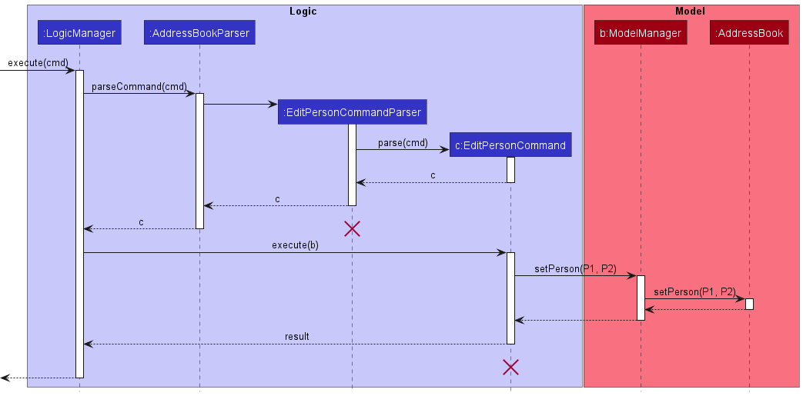

:information_source: **Note:** `cmd` in the diagram represents the edit
person command text entered by user; the `setPerson(P1, P2)` method replaces person P1 with person P2 in the person list
in the model. The specific `UniquePersonList` operations are not shown in the diagram for simplicity.

#### Edit Gender field (Closer look)
Let's take a closer look at how the `EditPersonCommand` edits the `Gender` field.

The following activity diagram shows what happens when a user executes a new edit person command:

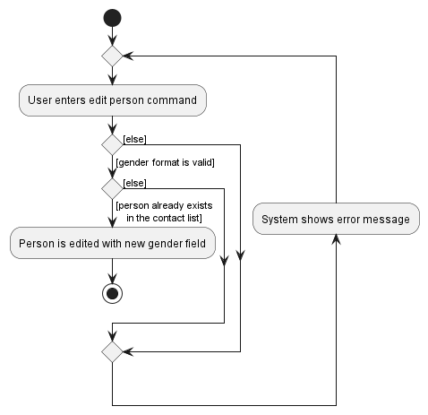

:information_source: **Note:** Only the
activities related to gender field are considered and shown in this activity diagram. All fields are considered optional
in edit person command, therefore, it is not compulsory to provide the gender field.

:information_source: **Note:**Parser exceptions are thrown and caught if
the gender is not of valid format; Invalid person exception is thrown if the person to edit doesn't exist in the
person list. Error message is displayed on the GUI subsequently.

:information_source: **Note:**Due to limitations of PlantUML, there are a few extra branch nodes that are created. Do ignore these.

#### Edit Date of Birth field (Closer look)
Let's take a closer look at how the `EditPersonCommand` edits the `date of birth` field.

The following activity diagram shows what happens when a user executes a new edit person command:

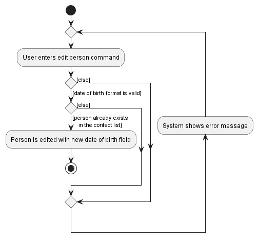

:information_source: **Note:** Only the
activities related to date of birth field are considered and shown in this activity diagram.

:information_source: **Note:**Parser exceptions are thrown and caught if
the date of birth is not of valid format; Invalid person exception is thrown if the person to edit doesn't exist in the
addressbook. Error message is displayed on the GUI subsequently.

:information_source: **Note:**Due to limitations of PlantUML, there are a few extra branch nodes that are created. Do ignore these.

### Make Statistics

The Make Statistics feature that is accessed through the `makeStats` command allows users to generate statistics of the persons of the `Person` class that are tagged to an event of the `Event` class, and shows a piechart of the statistics in a new window.

There are 2 types of statistics that can be generated:
* Age: Shows the proportion of age groups of the `persons` tagged to the `event`. Each age group has a 5-year age range.
* Gender: Shows the proportion of genders of the `persons` tagged to the `event`, seperating them into either `Male` or `Female` categories.

Users will specify the following fields for the makeStats command below:
- Index of the `event`
- Type of statistic to generate from the `event`

:information_source: **Note:** Age is generated using the date of birth of the persons tagged to the event and is calculated with respect to the real-time date when the application is run.

The `makeStats` operation is facilitated by `MakeStatsCommand` which extends from `Command`. If the users' input matches
the `COMMAND_WORD` of `MakeStatsCommand` in `AddressBookParser#parseCommand()`, `MakeStatsCommandParser#parse()` will
process the additional user input which constitutes the 2 compulsory fields above and return a `MakeStatsCommand`.

Executing this Command object through the `MakeStatsCommand#execute()` first triggers the `Model` interface's
`Model#setData()`. This operation updates the list of piechart data in the `Model`.

 Then, the `Logic` interface's `Logic#setPieChartData()` is triggered. This operation subsequently calls upon the `MainWindow#setPieChart()` operation which in turn calls upon the `MainWindow#handleStats()` operation, which finally culminates with a call upon the `StatsWindow#show()` which displays the piechart in a new window.

The following sequence diagram shows the methods calls related to the make stats operation:

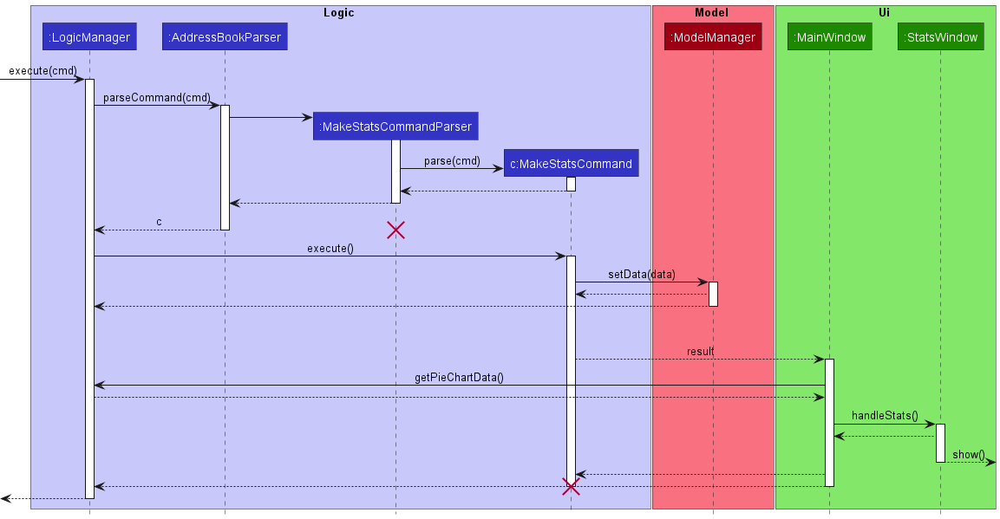

:information_source: **Note:** `cmd` in the diagram represents the make stats command text entered by user.

--------------------------------------------------------------------------------------------------------------------

## **Documentation, logging, testing, configuration, dev-ops**

* [Documentation guide](Documentation.md)
* [Testing guide](Testing.md)
* [Logging guide](Logging.md)
* [Configuration guide](Configuration.md)
* [DevOps guide](DevOps.md)

--------------------------------------------------------------------------------------------------------------------

## **Appendix: Requirements**

### Product scope

**Target user profile**: Duke The Market aims to help marketers of department stores better manage customer profiles and keep track of target customers during market plan rollouts.

* needs to manage a significant number of customer persons
* prefers desktop apps over other types
* can type fast
* prefers typing to mouse interactions
* is reasonably comfortable using CLI apps
* needs to oversee many marketing events
* needs to track customer activity in own department store
* needs to generate statistics based of customer data

**Value proposition**: A one-stop marketing tool that allows department stores to manage and organize their customer persons for usage in the company’s various marketing plans

### User stories

Priorities: High (must have) - `* * *`, Medium (nice to have) - `* *`, Low (unlikely to have) - `*`

| Priority  | As a …​                                               | I want to …​                                                                                                     | So that I can…​                                                                                                                                             |
|-----------|-------------------------------------------------------|------------------------------------------------------------------------------------------------------------------|-------------------------------------------------------------------------------------------------------------------------------------------------------------|
| `* * *`   | new user                                              | see usage instructions                                                                                           | refer to instructions when I forget how to use the App                                                                                                      |
| `* * *`   | frequent user                                         | update new data immediately                                                                                      | I can exit and enter the product freely                                                                                                                     |
| `* * *`   | frequent user                                         | enter and exit the product in a short amount of time                                                             | use the product on the fly                                                                                                                                  |
| `* * *`   | marketer                                              | add a new customer contact                                                                                       | keep track of all customers and enlarge the customer base over time                                                                                         |
| `* * *`   | marketer                                              | edit a customer contact                                                                                          | ensure that customers details are up to date                                                                                                                |
| `* * *`   | marketer                                              | delete a customer contact                                                                                        | remove contacts that I no longer need                                                                                                                       |
| `* * *`   | marketer                                              | find a customer contact by name                                                                                  | locate details of customers without having to go through the entire list                                                                                    |
| `* * *`   | marketer                                              | add a customer's date of birth to his contact in the system during contact creation                              | so that I can better understand the profile of customers who attended my events in terms of age and segment the customers for future marketing campaigns    |
| `* * *`   | marketer                                              | add a customer's gender to his contact in the system during contact creation                                     | so that I can better understand the profile of customers who attended my events in terms of gender and segment the customers for future marketing campaigns |
| `* *`     | marketer with many customer contacts                  | sort all customer contacts by name, date of birth or gender                                                      | locate people more easily and obtain contact lists of different demographic groups                                                                          |
| `* * *`   | pre-event marketer                                    | view all the upcoming marketing events in the system sorted in the order that they were added into the system    | have a high level overview of all marketing events and be mentally prepared for each of them                                                                |
| `* * *`   | pre-event marketer who handles many marketing events  | add marketing events                                                                                             | keep the system up to date with changes that happen to the marketing plans such as the development of new marketing campaigns                               |
| `* * *`   | pre-event marketer who handles many marketing events  | edit marketing events                                                                                            | keep the system up to date with changes that happen to the marketing plans that are present in the system                                                   |
| `* * *`   | pre-event marketer who handles many marketing events  | delete marketing events                                                                                          | remove marketing events that I no longer need                                                                                                               |
| `* * `    | pre-event marketer who handles many marketing events  | sort marketing events by date                                                                                    | so that I can take a look at when last few marketing events are scheduled and start planning ahead for more if those plans are to be executed soon          |
| `* * `    | pre-event marketer who handles many marketing events  | sort marketing events by name                                                                                    | so that I can locate events more easily                                                                                                                     |
| `* *`     | post-event marketer with many marketing events        | generate statistics of marketing events based on the gender and age demographics of my event attendees           | evaluate the success of my marketing campaigns                                                                                                              |
| `* *`     | post-event marketer with many marketing events        | generate a mailing list of people who attended the event                                                         | reach out to the people for feedback about the event                                                                                                        |

### Use cases

(For all use cases below, **UC** is the `Use Case`, the **System** is `Duke The Market` and the **Actor** is the `user`, unless specified otherwise)

**UC01: Delete an event**

**MSS**

1. User requests to list events
2. Duke The Market shows a list of events
3. User requests to delete a specific event in the list
4. Duke The Market deletes the event

   Use case ends.

**Extensions**

* 2a.  The list is empty.

  Use case ends.

* 3a.  The given index is invalid.

    * 3a1. Duke The Market shows an error message

    Use case resumes at step 2.

**UC02: Add a customer**

**MSS**

1.  User requests to add a customer of specific name, phone number, email, address, gender and date of birth
2.  Duke The Market adds the customer

    Use case ends.

**Extensions**

* 1a. User enters data in an invalid format.

    * 1a1. Duke The Market requests for the correct data

    * 1a2. User enters new data

    Steps 1a1-1a2 are repeated until the data entered is correct

    Use case resumes at step 2.

* 1b. User enters data for an individual who already exists in the database.

    * 1b1. Duke The Market shows an error message that the user is a duplicate customer

    * 1b2. User enters new data

    Steps 1b1-1b2 are repeated until the data entered is correct and not a repeat of an individual already in the database.

    Use case resumes at step 2.

**UC03: View the overall performance of a past event**

**MSS**
1.  User requests to list events
2.  Duke The Market shows a list of events
3.  User requests to generate statistics about an ongoing/past event in the list
4.  Duke The Market shows the visual representation of the statistics about that event

    Use case ends.

**Extensions**

* 2a. The list is empty.

  Use case ends.

* 3a. The given index is invalid.
    * 3a1. Duke The Market shows an error message.

    Use case resumes at step 3.

**UC04: Export email addresses of customers to a file**

**MSS**
1. User requests to list events
2. Duke The Market shows a list of events
3. User requests to export to a specified file the email address of customers who attended a specific event on the list.
4. Duke The Market exports the customers’ email addresses to the specified file

    Use case ends.

**Extensions**

* 2a. The list is empty.

  Use case ends.

* 3a. The given index is invalid.

    * 3a1. Duke The Market shows an error message.

      Use case resumes at step 3.

**UC05: Edit an event**

**MSS**

1. User requests to list events
2. Duke The Market shows a list of events
3. User requests to edit one or more fields of a specific event on the list (event title, date, time or purpose)
4. Duke The Market edits the event

   Use case ends.

**Extensions**

* 3a. User enters data in an invalid format.

    * 3a1. Duke The Market requests for the correct data

    * 3a2. User enters new data

  Steps 3a1-3a2 are repeated until the data entered is correct

  Use case resumes at step 4.

**UC06: Sort customers by a field**

**MSS**

1. User requests to sort all customers based on a field (e.g Gender)
2. Duke The Market displays a sorted list of all customers

   Use case ends.

**Extensions**

* 1a. Field to sort by is not a valid.

    * 1a1. Duke The Market requests for the correct field to sort by

    * 1a2. User enters new field to sort by

  Steps 1a1-1a2 are repeated until the field entered is correct

  Use case resumes at step 2.

### Non-Functional Requirements

1. Should work on any mainstream OS as long as it has Java 11 or above installed.
2. App should not require installation to work (i.e. it is portable)
3. App should work well for standard screen resolutions 1920x1080 and higher, as well as for screen scales 100% and 125%.
4. App should be usable (i.e. all functions can be used even if the user experience is not optimal) for resolutions 1280x720 and higher, as well as for screen scales 150%.
5. Should be able to hold up to 1000 customers and 200 events without a noticeable sluggishness in performance for typical usage.
6. A user with above average typing speed for regular English text (i.e. not code, not system admin commands) should be able to accomplish most of the tasks faster using commands than using the mouse.
7. The system should respond within 5 seconds.
8. Data should be stored locally in a human editable text file.
9. Data should not be stored using an external database management system (DBMS)
10. File size of the data should not exceed 1GB (should be stored in a space saving manner)
11. App should be an executable (Double-clicked or can be run using the `java -jar` command).

*{More to be added}*

### Glossary

* **Mainstream OS**: Windows, Linux, Unix, OS-X
* **Interested customers**: Customers who have attended similar events in the past.

--------------------------------------------------------------------------------------------------------------------

## **Appendix: Instructions for manual testing**

Given below are instructions to test the app manually.

:information_source: **Note:** These instructions only provide a starting point for testers to work on;
testers are expected to do more *exploratory* testing.

### Launch and shutdown

1. Initial launch

    1. Download the jar file and copy into an empty folder

    2. Double-click the jar file Expected: Shows the GUI with a set of sample persons and events. The window size may not be optimum.

1. Saving window preferences

    1. Resize the window to an optimum size. Move the window to a different location. Close the window.
    
    2. Re-launch the app by double-clicking the jar file. 
        Expected: The most recent window size and location is retained.

### Deleting a person

1. Deleting a person while all persons are being shown

    1. Prerequisites: List all persons using the `listPersons` command. Multiple persons in the person list.

    2. Test case: `deletePerson 1` 
       Expected: First person is deleted from the person list. Details of the deleted person are shown in the result display.

    3. Test case: `deletePerson 0` 
       Expected: No person is deleted. Error message is shown in the result display.

    4. Other incorrect deletePerson commands to try: `deletePerson`, `deletePerson x`, `...` (where x is larger than the person list size) 
       Expected: Similar to previous test case.

3. Deleting a person while some persons are being shown

    1. Prerequisites: List only some persons using the `findPersons` command and specify certain keywords.

    2. Test case: `deletePerson 1` 
       Expected: First person is deleted from the current displayed person list. Details of the deleted person are shown in the result display.

    3. Test case: `deletePerson 0` 
       Expected: No person is deleted from the current displayed person list. Error message is shown in the result display.

    4. Other incorrect deletePerson commands to try: `deletePerson`, `deletePerson x`, `...` (where x is larger than the person list size) 
       Expected: Similar to previous test case.

### Adding a person

1. Adding a person

    1. Prerequisites: The name of the newly added person should not be the same as the names of any persons
    stored in the person list of the application correctly.

    2. Test case: `addPerson n/person a/street e/person@gmail.com p/12345678 d/01/01/2000 g/m` 
       Expected: A person is added to the end of the person list. Details of the added person are shown in the result display.

    3. Test case: `addPerson n/person` 
       Expected: No person is added. Error message is shown in the result display.

    4. Other incorrect addPerson commands to try: `addPerson 1`, `addPerson n/person a/street e/person@gmail.com p/12345678 d/01.01.2000 g/m`, `...`
       (where the date of birth is in the wrong format) 
       Expected: Similar to previous test case.

### Listing Events by Event Date
1. Listing Events by their Event Titles
    1. Prerequisites: Multiple events in the event list.

    2. Test case: `listEvents s/d` 
       Expected: All events are listed and sorted by their dates from oldest event to the newest event. If two events have the same date, they are sorted by oldest to newest time.
       A success message is shown in the result display. The first event has the oldest event date.

    3. Test case: `listEvents 123` 
       Expected: Current event list remains the same and no events are sorted. Error message is shown in the result display.

    4. Other incorrect listEvent commands to try: `LISTEVENTS s/d`, `listEvents s/d e`, `listEvents s/n` 
       Expected: Similar to previous test case.

    5. `listEvents s/d` lists and sorts all events by their dates even if the event list does not display all events due to the `findEvents` command.

### Tagging Person(s) to an Event
1. Tagging a person to an Event
    1. Prerequisites: There must be at least 1 event in the event list and 1 person in the person list.

    2. Whenever a valid tagging is done, all events in the current event list are displayed and the tagged event is updated to reflect the new tagged person.

    3. Test case: `tagEvent 1 p/1` 
       Expected: The first person in the current person list is tagged to the first event in the current event list. A success message is shown in the
       result display, indicating that the first person has been tagged to the first event.

    4. Test case: `tagEvent 0 p/1` 
       Expected: No person is tagged to an event. Error message is shown in the result display.

    5. Other incorrect tagEvent commands to try: `tagEvent x p/y` (where either x is larger than the size of the current event list or y is
       larger than the size of the current person list), `TAGEVENT 1 p/1`, `tagEvent 1 p/x` (where x is the index of a person that is already tagged to the first event
       in the current event list). 
       Expected: Similar to previous test case.

2. Tagging multiple persons to an Event
    1. Prerequisites: There must be at least 1 event in the event list and more than 1 person in the person list.

    2. Whenever a valid tagging is done, all events in the current event list are displayed and the tagged event is updated to reflect the new tagged persons.

    3. Test case: `tagEvent 1 p/1 2` 
       Expected: The first and second person in the current person list is tagged to the first event in the current event list. A success message
       is shown in the result display, indicating that the first and second person has been tagged to the first event.

    4. Test case: `tagEvent 0 p/1 2` 
       Expected: No persons are tagged to an event. Error message is shown in the result display.

    5. Other incorrect tagEvent commands to try: `tagEvent x p/y z` (where either x is larger than the size of the current event list or y or z is
       larger than the size of the current person list), `TAGEVENT 1 p/1 2`. `tagEvent 1 p/x y` (where either x or y is the index of a person that is already tagged in the
       first event in the current event list), `tagEvent 1 p/1 1` 
       Expected: Similar to previous test case.

### Untagging Person(s) from an Event
1. Untagging a person from an Event
    1. Prerequisites: There must be at least 1 person tagged to an event in the event list and this person must appear in the current displayed person list.

    2. Whenever a valid untagging is done, all events in the current event list are displayed and the untagged event is updated to reflect the leftover tagged person(s).

    3. Test case: `untagEvent x p/y` (where x is the index of an event present in the current event list and y is the index of a person that is in the current person list and
       also is tagged to the event in event index x) 
       Expected: The person with index y in the current person list is untagged from the event with index x in the current event list. A success message is shown in the
       result display, indicating that the name of the person with index y in the current person list has been untagged from the event title of the event with index x
       in the current event list.

    4. Test case: `untagEvent 0 p/1` 
       Expected: No person is untagged from an event. Error message is shown in the result display.

    5. Other incorrect tagEvent commands to try: `untagEvent x p/y` (where either x is larger than the size of the current event list or y is
       larger than the size of the current person list), `UNTAGEVENT 1 p/1`, `untagEvent 1 p/x` (where x is the index of a person that is not tagged in the first event
       in the current event list). 
       Expected: Similar to previous test case.

2. Untagging multiple persons from an Event
    1. Prerequisites: There must be more than 1 person tagged to an event in the event list and these persons must appear in the current displayed person list.

    2. Whenever a valid untagging is done, all events in the current event list are displayed and the untagged event is updated to reflect the leftover tagged person(s).

    3. Test case: `untagEvent x p/y z` (where x is the index of an event present in the current event list and y and z is the index of a person that is in the current person list and
       also is tagged to the event in event index x) 
       Expected: The persons with index y and z in the current person list are untagged from the event with index x in the current event list. A success message is shown in the
       result display, indicating that the names of the persons with index y and z in the current person list has been untagged from the event title of the event with index x
       in the current event list.

    4. Test case: `untagEvent 0 p/1 2` 
       Expected: No person is untagged from an event. Error message is shown in the result display.

    5. Other incorrect tagEvent commands to try: `untagEvent x p/y z` (where either x is larger than the size of the current event list or y or z is
       larger than the size of the current person list), `UNTAGEVENT 1 p/1 2`, `untagEvent 1 p/x y` (where either x or y is the index of a person that is not tagged in the first event
       in the current event list). 
       Expected: Similar to previous test case.

### Generating a pie chart statistic for an Event
1. Generating a pie chart statistic from an Event
    1. Prerequisites: An event in the current event list should have at least 1 tagged person.

    2. Test case: `makeStats x t/g` (where x is the index of an event that has at least 1 tagged person) 
       Expected: A new window is opened, showing a pie chart of the gender statistics for the event in event index x of the current event list.
       Success message is shown in the result display.

    3. Test case: `makeStats 0 t/g` 
       Expected: No new window is opened. Error message is shown in the result display.

    4. Other incorrect makeStats commands to try: `MAKESTATS 1 t/g`, `makeStats 1 t/g a` 
       Expected: Similar to previous test case.

### Creating a mailing list for an Event
1. Generating a mailing list from an Event
    1. Prerequisites: An event in the current event list should have at least 1 tagged person.

    2. Test case: `mailEvent 1` 
       Expected: A CSV file with the name of the event title of the first event is created in the /data folder.
       Success message is shown in the result display.

    3. Test case: `mailEvent 0` 
       Expected: No CSV files are created. Error message is shown in the result display.

    4. Other incorrect makeStats commands to try: `MAILEVENT 1`, `mailEvent x` (where x is larger than the size of the displayed event list) 
       Expected: Similar to previous test case.

### Saving data

1. Dealing with missing/corrupted data files

    1. Test case: Delete the data file manually when not inside the application (by deleting the addressbook.json file) 
       Expected: Duke The Market launches with a set of sample data. Executing any valid command that updates data will create a new data file
       with the new data.

    2. Test case: Add invalid characters like `*` into the data file manually when not inside the application (by editing the addressbook.json file) 
       Expected: Duke The Market launches with an empty set of data. Executing any valid command that updates will create a new data file
       with the new data.

    3. Test case: Deleting or editing the data file manually while inside the application 
       Expected: Executing any valid command will overwrite whatever changes were made manually and the data file will contain new data
       according to the application that is currently running.

--------------------------------------------------------------------------------------------------------------------

## **Appendix: Effort**

Our group felt that the project was slightly difficult. Although our group has put in extensive effort into the planning of the project,
we still encountered numerous merge conflicts and situations that we did not expect (needing to change how we implement the storage of certain
entities). Compared to other groups, we believe that we have put in an average amount of effort because one of the past lectures mentioned how
most groups had over-exceeded the amount of effort that is actually required.

Fortunately, some members within the group were able to experience first-hand working with others on a serious Software Engineering project. For
those that were more experienced, we still had new takeways when we worked with other members in the group and we were able to guide each other
and receive proper feedback from other groups in class as well as hold respectful discussions within the group. We believe our product has
some use in the real world as it is simple enough to be used and can even be extended to other uses.

Additionally, our group gained more experience when it came to manual and automated testing. We were better able to learn a more complex test suite
offered by AB3 and adapted it for own use.

Compared to AB3 which deals with only one entity type (Person), our group dealt with two entity types (Person and Event). Though some of the fields
were similar in implementation, our group had struggled slightly with learning how to tag multiple person(s) to one event as each suggestion that
every team member came up with had its pros and flaws.
